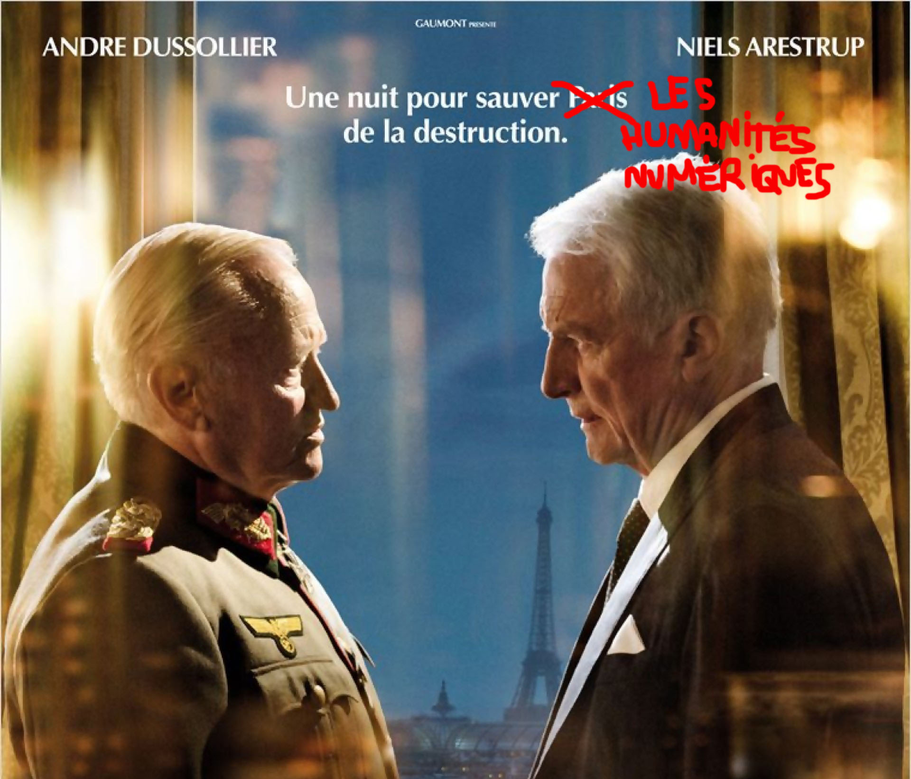

# Diplomatie

Cet espace est dédié au projet Diplomatie. Celui est constitué de deux dossiers :
* Un dossier **"bac_a_sable"** dans lequel je mettrais à disposition des bouts de code qui permettent de répondre à des questions simples _bas niveau_
* Un dossier **"pro"** dans lequel sera entreposé une application bout en bout qui remplira les missions suivantes : récupération des données, structuration des données, extraction d'entités, et analyse.

