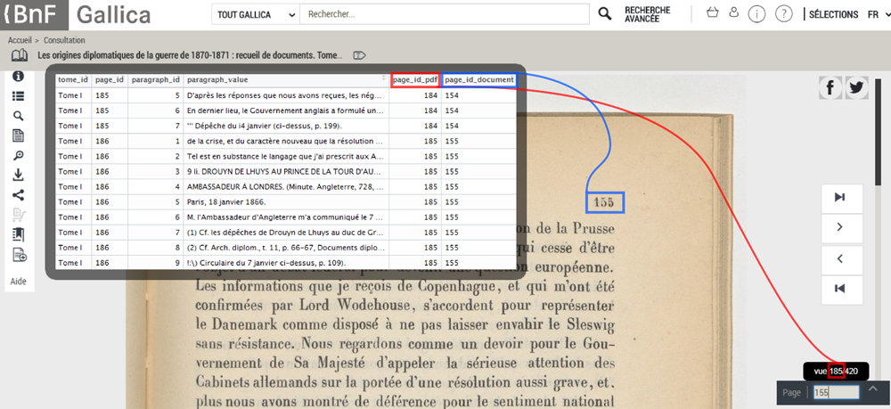

Structuration des données
================

#### Objectif

-   Structurer la liste des tomes téléchargée depuis l'API Gallica sous la forme d'un dataframe. Une observation correspond à un paragraphe. Chaque paragraphe est mappé vers un paragraphe ID, une page ID et un tome ID.

-   Ajouter deux nouvelles variables.
    -   PDF Page ID : correspond au numéro de la page du document PDF accessible en ligne depuis le site de Gallica.
    -   Document Page ID : correspond au numéro de la page du document OCRisé.

#### Paramètres

L'unique paramètre est la liste `PARAM_correction_dataframe_list` qui renseigne les différents écarts qui existent entre les différents numéro de page. On peut également renseigner les bornes des pages pour lesquelles les pages sont numerotées en chiffres romains. Le code ci-dessous est un exemple de liste qui ne contient que des informations pour le tome I. Ce paramètre est modifiable dans le script ***config/parameters.R***

``` r
PARAM_correction_dataframe_list = list()
PARAM_correction_dataframe_list[["Tome I"]] = data.frame("tome_id" = "Tome I",
                                                         "page_id_pdf_correction" = -1,
                                                         "page_id_document_correction" = -31,
                                                         "pdf_latin_pagination_start" = 13,
                                                         "pdf_latin_pagination_end" = 29)
```

#### Informations complémentaires

Le fichier `main.R` permet de répondre aux deux objectifs. Le dataframe final est sauvegardé dans le dossier ***/data*** sous le nom `DATA_the_book_df.rds`. L'image ci-dessous illustre la structure du dataframe final


