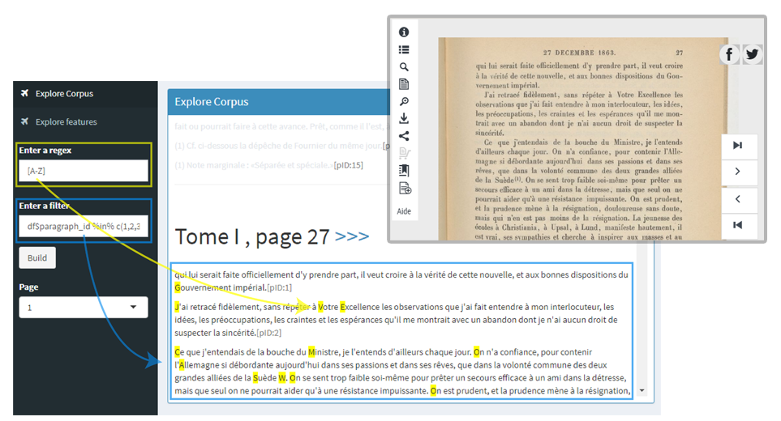

#### Motivation

La création de features basées sur des regex est cruciale dans la détection des différentes entités que l'on souhaite extraire. Il est ainsi utile, d'avoir un outil pour parcourir le corpus et visualiser des regular expressions. J'ai donc crée une application Shiny. 


#### Utilisation

La bonne pratique est de créer les features dans le dataframe **df**, grâce au script `corpusapp/config.R`. Une fois les features créées, elles pourront servir de filtre dans l'application Shiny. Exemple de création de features :
```{r}
df = readRDS(file = "C:/Users/Bar Yokhai/Desktop/projets/Blog/diplomatie/pro/step3_detection/deployedapp/corpusapp/DATA_the_book_df.rds")
# Feature 01 qui représente le nombre de caractères dans un paragraphe
df$FEATURE_01 = nchar(df$paragraph_value)
```

#### L'application Shiny

L'application permet de parcourir le corpus téléchargé via les requêtes à l'API Gallica. Elle permet également de créer une filtre sur les paragraphes à afficher. L'idée est de créer une combinaison des features créées. Par exemple, tu peux vouloir ne sélectionner que les 5 derniers paragraphes qui comprennent une certaine proportion de majuscules. L'application permet également de visualiser les matchs d'une regex définie. Cette option te permettra de créer des features plus facilement.

```{r, echo=FALSE,out.width = "800px"}

```

* Pour lancer l'application en local, ouvrir `corpusapp/ui.R`, puis cliquez sur la petite icône en haut à droite, **Run App**
* L'application est également disponible [ici](https://snak.shinyapps.io/corpusregex/) 


