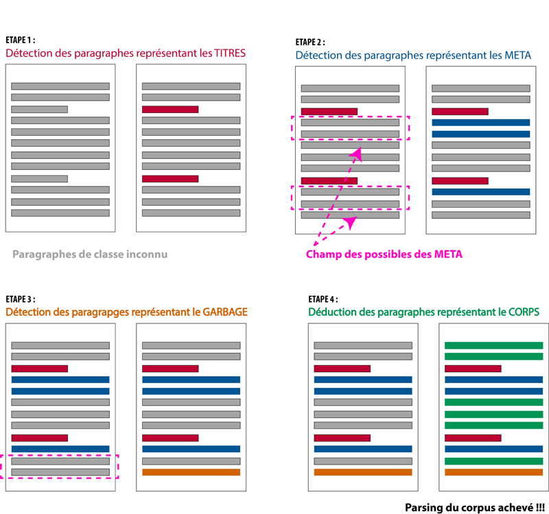
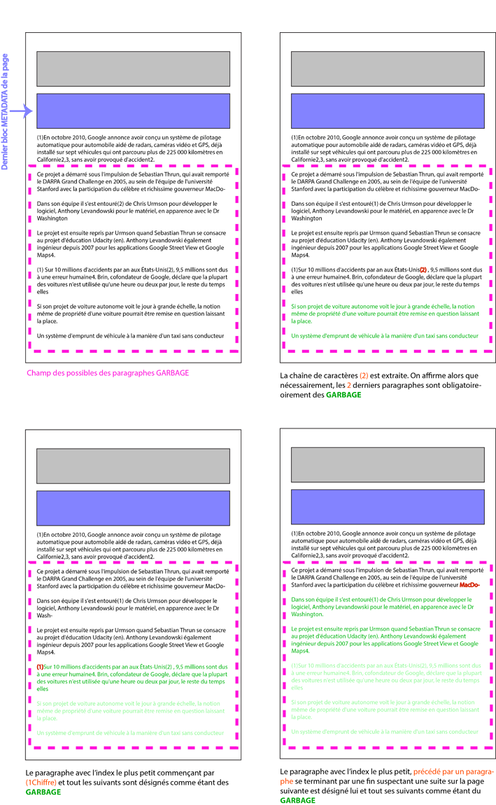

Parsing du Corpus, la démarche
================

Objectif
--------

L'objectif est de parser le corpus téléchargé via l'API GAllica. Par parsing, on entend l'extraction des entités suivantes :

-   Dépêche
    -   Titre
    -   Méta données
        -   Expéditeur
        -   Destinataire
        -   Lieu
        -   Date
    -   Corps du message
    -   Annotations

Partie I
--------

#### Observations

On observe les choses suivantes :

-   Un paragraphe ne peut appartenir qu'à une des 4 classes suivantes : TITRE, METADATA, CORPS, GARBAGE (annotations de bas de page)
-   Les classes de paragraphes METADATA, CORPS et GARBAGE ont des positions très précises au sein du corpus :
    1.  Les paragraphes constituant les METADATA d'une dépêche sont toujours situés dans les 1 à 3 slots juste après les paragraphes constituant le TITRE d'une dépêche
    2.  Les paragraphes constituant le GARBAGE sont toujours situés dans les X derniers slots d'une page.
    3.  Les paragraphes constituant le CORPS de la dépêche sont toujours situés entre le bloc METADATA s'il existe et le bloc GARBAGE ou TITRE de la dépêche suivante

#### Idée générale

L'idée générale repose sur l'assignation de chaque paragraphe à la classe à laquelle il est censé appartenir à travers le **procédé par élimination** suivant :

1.  On repère en premier lieu les paragraphes composant les TITRES car ceux-ci sont caractérisés par le pattern le plus robuste
2.  On repère ensuite les paragraphes constituant les METADATA en exploitant les résultats précédents. En effet, les paragraphes METADATA ne peuvent se situer ailleurs que sur les 3 slots qui suivent le dernier paragraphe qui constitue le TITRE d'une dépêche Autrement dit, la détection des TITRES nous permet de réduire le champ des possibles des paragraphes constituant les METADATA
3.  On repère ensuite les paragraphes constituant le GARBAGE en exploitant les résultats précédents. En exploitant la position des TITRES, des METADATA, ainsi que des fins de pages, on réduit le champ des possibles des paragraphes représentant le GARBAGE
4.  Les paragraphes encore non assignés constituent le CORPS des dépêches

#### STEP 1 - Détection des paragraphes TITRES

Un bloc paragrapaghes est un bloc TITRE s'il respecte les conditions suivantes :

-   Sa proportion de majuscules situé hors de parenthèses est relativement élevée
-   Sa longueur en nombre de mots dépasse un certain seuil
-   Le nombre de paragraphes qui le composent ne dépasse pas 3

#### STEP 2 - Détection des parangraphes METADATA

Un bloc paragrapaghes est un bloc METADATA s'il respecte les conditions suivantes :

-   il est précédé par un bloc TITRE
-   Sa proportion de chiffres, ponctuation ou mois de l'année est relativement élevée
-   Sa longueur en nombre de mots est inférieur à un certain seuil
-   Le nombre de paragraphes qui le composent ne dépasse pas 4

#### STEP 3 - Détection des paragraphes GARBAGE

1.  Dans premier temps, on recherche à l'intérieur de l'espace défini par le bloc METADATA le plus proche d'une fin de page + 1 et une fin de page, les chaînes de caractères respectant la structure (1CHIFFRE). Le chiffre X le plus élevé entre parenthèses ainsi extrait nous permet d'affirmer que les paragraphes \[n-X\] à n sont nécessairement des paragraphes GARBAGE (avec n, l'index du dernier paragraphe d'une page)

2.  Dans un second temps, on recherche parmi les paragraphes non encore assignés, le paragraphe commencant par (1Chiffre) dont l'index est et le plus petit. Celui-ci ainsi que tout les suivants jusqu'à la fin d'une page sont désignés comme étant du GARBAGE

3.  Puis, on recherche parmi les paragraphes non encore assignés le paragraphe dont l'index est le plus petit pour lesquels le paragraphe précédent se termine par une fin suspectant une suite sur la page suivante. Ce paragraphe ainsi que tout ceux qui le suivent jusqu'à la fin de la page sont désignés comme étant du GARBAGE

#### STEP 4 - Détection des paragraphes CORPS

Tout les paragraphes qui ne sont ni des TITRES, ni des METADATA, ni du GARBAGE sont désignés comme étant des paragraphes CORPS
